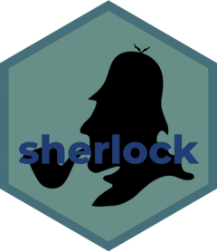

<!-- README.md is generated from README.Rmd. Please edit that file -->

# sherlock 

<!-- badges: start -->
<!-- badges: end -->

The goal of sherlock is to provide access to the full texts of Sherlock
Holmes stories that are in the public domain. Text and further
information regarding copyright laws can be found
[here](https://sherlock-holm.es/ascii/).

## Installation

You can install the development version from
[GitHub](https://github.com/) with:

``` r
# install.packages("devtools")
devtools::install_github("EmilHvitfeldt/sherlock")
```

## Example

The data set is available as `holmes`

``` r
library(sherlock)
holmes
#> # A tibble: 65,958 × 2
#>    text                                 book              
#>    <chr>                                <chr>             
#>  1 "A STUDY IN SCARLET"                 A Study In Scarlet
#>  2 ""                                   A Study In Scarlet
#>  3 "Table of contents"                  A Study In Scarlet
#>  4 ""                                   A Study In Scarlet
#>  5 "Part I"                             A Study In Scarlet
#>  6 "Mr. Sherlock Holmes"                A Study In Scarlet
#>  7 "The Science Of Deduction"           A Study In Scarlet
#>  8 "The Lauriston Garden Mystery"       A Study In Scarlet
#>  9 "What John Rance Had To Tell"        A Study In Scarlet
#> 10 "Our Advertisement Brings A Visitor" A Study In Scarlet
#> # … with 65,948 more rows
```

and is named in such a way that `sherlock::holmes` can be called

``` r
sherlock::holmes
#> # A tibble: 65,958 × 2
#>    text                                 book              
#>    <chr>                                <chr>             
#>  1 "A STUDY IN SCARLET"                 A Study In Scarlet
#>  2 ""                                   A Study In Scarlet
#>  3 "Table of contents"                  A Study In Scarlet
#>  4 ""                                   A Study In Scarlet
#>  5 "Part I"                             A Study In Scarlet
#>  6 "Mr. Sherlock Holmes"                A Study In Scarlet
#>  7 "The Science Of Deduction"           A Study In Scarlet
#>  8 "The Lauriston Garden Mystery"       A Study In Scarlet
#>  9 "What John Rance Had To Tell"        A Study In Scarlet
#> 10 "Our Advertisement Brings A Visitor" A Study In Scarlet
#> # … with 65,948 more rows
```
